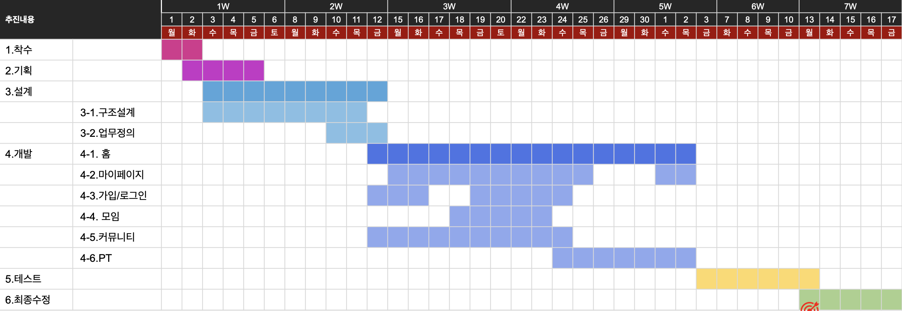
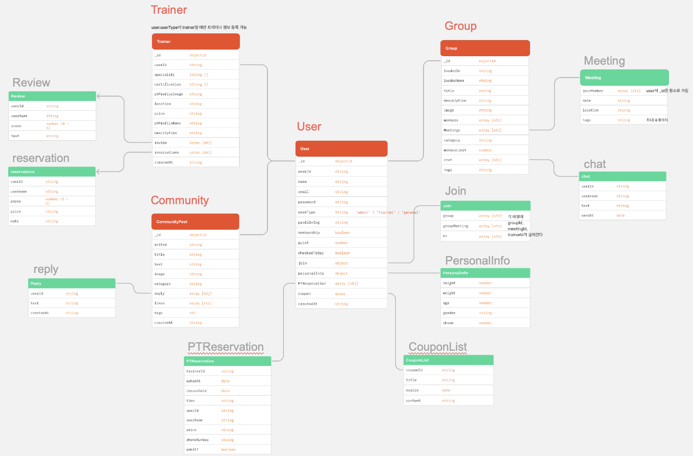
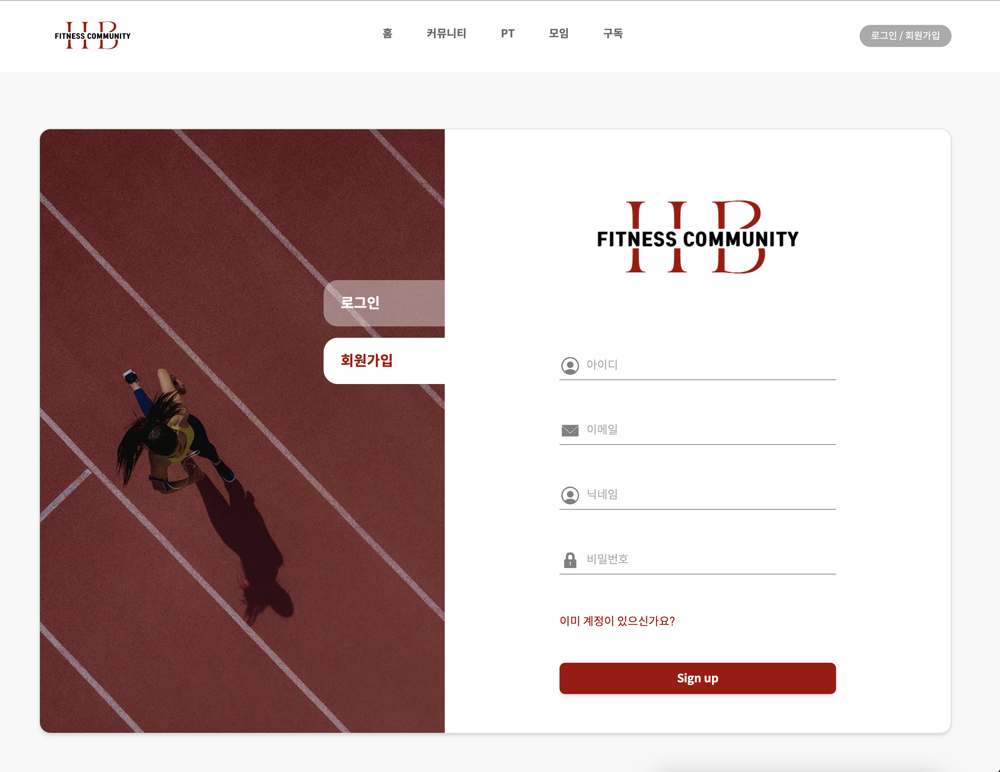
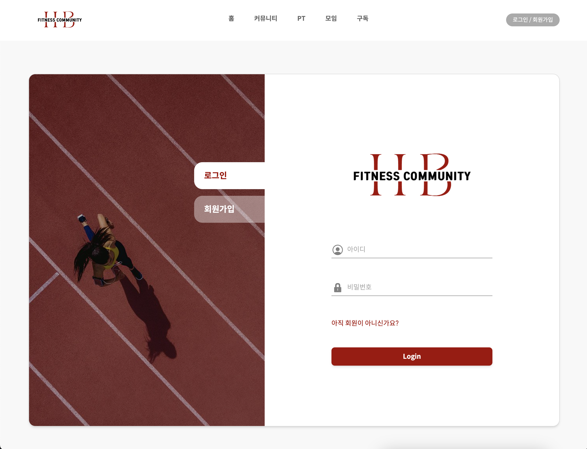
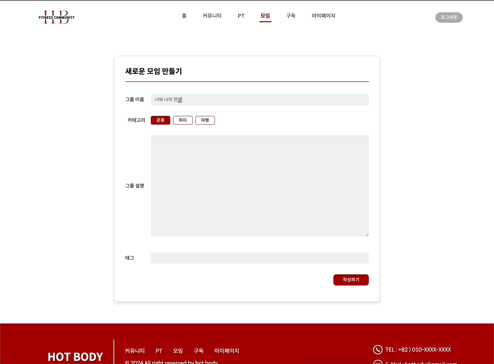
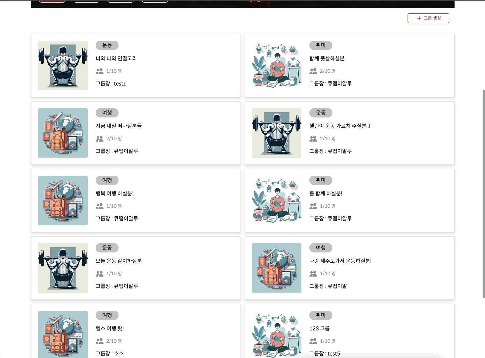

# HOT BODY | 운동 커뮤니티

   

## 목차
1. [프로젝트 설명](#01-프로젝트-개요)
2. [프로젝트 특징](#02-프로젝트-특징)
3. [기술 스택](#03-기술-스택)
4. [개발 기간](#04-개발-기간)
5. [역할 분담](#05-역할-분담)
6. [DB Schema](#06-db-schema)
7. [기능 설명](#07-기능-설명)
8. [프로젝트 후기](#08-프로젝트-후기)

 

### 01. 프로젝트 개요
타인과 함께하는 운동은 신체적 그리고 사회적으로 높은 가치를 지닌다. 목표를 함께 성취하는 과정에서 소속감을 형성하고 피드백을 주고 받으며 한단계 높은 결과를 만들어내기도 한다. 시장 조사 결과 운동 분야의 커뮤니티나 SNS가 제한적이었다. 이에 따라 운동을 함께 할 사람을 더 쉽게 찾을 수 있는 운동 커뮤니티 서비스를 기획하게 되었다. 

   

### 02. 프로젝트 특징
- MERN 스택을 사용한 풀 스택 개발
- 글 CRUD 이외에도 좋아요, 댓글과 같은 기존 커뮤니티의 모든 기능 구현
- PT 트레이너 검색 시 카카오 open api를 사용해 위도/경도를 기반으로 검색
- 비즈니스적으로 유저를 유치하기 위해 포인트와 구독 시스템 도입
- 배포까지 고려해서, 예기치 못한 상황에 에러 발생 시 앱 전체가 다운되지 않게 에러 핸들링에 신경

   

### 03. 기술 스택
#### Language & Library & Framework
 

#### State management

#### Database

#### Tools

  

   

### 04. 개발 일정 (WBS)
총 개발 기간 : 2024.04.01 ~ 2024.05.17

   

### 05. 역할 분담

#### 😎 김의현 (팀장)
- 마이페이지 전체
- 고객센터 검색 기능
- 약속 생성 모달 UI
  

#### 🥸 박예빈
- API 디자인
- 백엔드 설계 및 관리
- 커뮤니티, 모임, PT 전체 UI 및 기능
- 메인 페이지 슬라이더
- 유저 상태 전역 관리
  

#### 🤓 이성원
- 로그인, 회원가입 UI
- 구독 결제 UI
- PT 예약 UI 
  

#### 🤩 양재훈
- 구독 페이지 
- 메인 페이지 트레이너 UI

   

### 06. DB Schema

   

### 07. 기능 설명
#### [ 회원가입  ]

- Sign up 버튼 클릭 시 유저 정보를 DB에 저장하라는 API 요청을 보냄
- 중복 이메일로 가입하는 것을 방지. 
- 중복 이메일이 아닐 경우 비밀번호를 bcrypt를 사용해 해쉬화 한 후 유저 정보를 DB에 저장
- 요청 처리에 에러가 발생할 경우, 400 응답 값과 회원가입에 실패했다는 알림창이 우측하단에 뜸

  

#### [ 로그인 ]

- 로그인 요청 API 호출 시, 백엔드에서 해당 아이디로 가입한 유저가 있는지 탐색 후 있으면 입력한 비밀번호를 해시화 한 후 DB에 저장된 비밀번호와 일치하는지 판별
- 비밀번호가 일치한다면 인가 및 로그인 상태 유지를 위해 토큰을 생성한다. 
- 이때 토큰은 유저의 고유한 _id값 정보를 기반으로 생성되며 24시간동안만 유효하도록 설정
- 응답으로 200 상태 값과 유저 정보(비밀번호 제외한), 토큰을 보냄
- 200 상태값을 받으면 Context API를 사용해 유저 정보를 전역 상태로 관리
- 응답으로 받은 토큰 값은 localStorage에 저장하며, API 요청을 할 때마다 localStorage를 참조해서 값이 있으면 헤더 값에 토큰 값을 넣어서 유저를 식별 할 수 있게 함
- 또한 localStorage에 토큰 존재 여부에 따라 로그인 유지 상태가 결정

  

#### [ 메뉴바 ]

- localStorage의 토큰 참조 가능 여부에 따라 로그인 상태를 유지한다
- 만약 토큰을 참조할 수 없으면 로그인 상태가 아니니 '마이페이지'와 '로그아웃' 기능을 사용할 수 없다
- 로그인 상태라면 로그인/회원가입 페이지에 접근할 수 없는 대신 로그아웃 기능이 사용 가능하고 마이페이지에 접근할 수 있다

  

#### [ 커뮤니티 - 메인 페이지 ]

| 글 조회 요청 성공 시 커뮤니티 메인 페이지 | 서버 연결 에러로 요청 3번 연속 실패 시 에러 컴포넌트 렌더링 |
| :-----------------------------: | :--------------------------------------------: |
|       ![community_success]      |               ![community_error]               |

- 사용자가 페이지 방문 시 DB에서 모든 글을 조회 요청하는 API 호출
- 글을 조회하는 동안에는 로딩 상태임을 알 수 있게 Skeleton UI 렌더링
- 서버, 네트워크 또는 요청 도중 처리에 에러가 발생할 경우 리액트 쿼리가 3번까지 refetch
- 3번째에도 요청 처리에 실패하면 앱 전체가 다운되지 않도록 에러 사유를 알리는 에러 컴포넌트를 렌더링
- 구독자에게 혜택을 제공하기 위해 구독자의 글에는 뱃지 아이콘 표시
- 카테고리별 필터링 기능

  

#### [ 커뮤니티 - 글 작성 ]

- 로그인 한 유저만 이용 가능하기 때문에 글 작성 페이지 방문 시 전역의 유저 정보를 참조할 수 없으면 커뮤니티 메인페이지로 라우팅
- 글 작성 시 10 포인트 획득
- 마이페이지에서 유저가 작성한 글을 조회할 수 있게 유저의 wrote에 해당 글의 고유 id값을 추가 해둠

  

#### [ 커뮤니티 - 상세 페이지 ]
|  좋아요 / 댓글 작성 및 삭제 기능  |  기존 글 수정 및 삭제 기능  |
| :------------------------: | :--------------------: |
|   ![community_detail_01]   | ![community_detail_02] |

- 상세 페이지 기능 : 좋아요, 댓글 작성/삭제, 글 수정/삭제
- 좋아요 기능
  - 로그인 한 사용자에 한해서 좋아요, 댓글 기능 권한 허용
  - 유저의 로그인 여부는 전역 상태에 유저의 고유한 _id값을 참조할 수 있으면 참이고 그렇지 않으면 거짓
  - 좋아요를 이미 한 상태에서 좋아요를 클릭 하면 좋아요 취소
  - 좋아요 여부를 식별하는 기준은 각 글의 likes 배열 속성. likes 배열은 유저들의 _id값을 요소로 가짐. 이 likes 배열을 순회하면서 요청을 보낸 유저의 _id와 같은 값이 있는지 찾음
- 댓글 기능
  - 댓글 작성 후 삭제 버튼은 댓글을 작성한 사람에게만 보임
- 글 수정/삭제 기능
  - 해당 글을 작성한 사람에게만 권한이 주어짐

  

#### [ PT - 트레이너 등록 및 검색 ]
|   트레이너 등록 및 검색  | 자신의 트레이너 정보 조회 |
| :-----------------: | :-----------------: |
|    ![pt_register]   |    ![pt_mypage]     |

- 트레이너 등록은 '일반' 등급 유저에 한해서 무분별한 정보 도배를 방지하기 위해 1번만 허용
- 등록시 주소 유효성 검사 시 해당 주소의 위도/경도를 계산하는 카카오 open API 사용. 위도/경도 값을 조회할 수 없으면 다른 주소 입력해야 함
- 사용자가 트레이너 검색 시, 주소를 입력하면 해당 주소의 위도/경도를 구한다.
- 검색 시 과도한 요청을 방지하기 위해서 debounce 훅을 커스텀해서 사용했으며, 사용자가 입력 후 0.5초간 더이상 입력이 없으면 위도/경도 계산 후 근처 트레이너 목록 요청 API를 호출
- 사용자가 입력한 주소의 위도/경도의 오차범위 ±0.01 안에 있는 모든 트레이너 정보를 찾아서 응답으로 반환
- 결과로 출력된 트레이너 목록에서 특정 트레이너 정보 클릭 시 추가 정보를 볼 수 있게 설계

  

#### [ PT - 트레이너 상세 정보 및 예약 ]

- 검색 결과에서 상세보기 버튼 클릭 시 해당 트레이너의 상세 정보 페이지로 이동
- 해당 트레이너에게 예약 요청 할 수 있는 기능
- 예약 성공 시 마이페이지에서 요청 이력 조회 가능

  

#### [ 모임 - 메인 페이지 ]

- 카테고리는 운동, 취미, 여행. 카테고리 별로 필터 가능하며 디폴트값은 전체
- 전체 카테고리 선택 시 가장 최근 등록된 모임 10개 조회 요청하는 API 호출
- 로딩 중에는 Skeleton UI가 렌더링 된다
- 비동기 데이터 fetching에 3번 연속 실패시 에러 컴포넌트 렌더링

  

#### [ 모임 - 생성 페이지 ]

- 구독자일 경우 모임의 정원이 30명, 비구독자는 10명
- 모임 생성 시, 작성자는 그룹장이되며 모임에 자동적으로 가입
- 모임 생성 성공 시 메인 페이지에서 바로 조회 가능

#### [ 모임 - 가입 및 약속 생성 ]

- 가입 기능
  - 가입 요청 시, 가장 먼저 정원인지 아닌지 확인. 정원일 경우 toast 알림창이 뜬다
  - 중복 가입을 방지하기 위해, 가입 버튼 클릭 시 유저의 가입 여부 확인 후 가입
  - 이미 가입된 경우 가입 요청 시 toast 알림창이 뜬다
  - 마이페이지에서 가입한 모임 목록을 조회할 수 있다
- 약속 생성
  - 해당 모임에 가입한 유저들에게만 제공되는 기능
  - 약속 생성 시 상세 페이지에서 바로 업데이트 되어 확인 가능

  

#### [ 마이페이지 - 계정 정보 ]
|   계정 정보 수정  |  상세(신체) 정보 수정 |
| :------------: | :--------------: |
| ![my_account]  | ![my_detailInfo] |

- 계정 정보 수정 기능
  - 수정 가능한 정보는 이름, 이메일, 아이디
  - 수정하려면 비밀번호를 입력해야 하며, 일치해야 함
- 상세 정보 수정
  - 사용자의 신체 정보를 수정할 수 있다
  - 키, 체중, 나이, 성별, 연락처, 운동목적에 대한 내용이 있음

#### [ 마이페이지 - 쓴 글 조회 / PT 예약 조회 / 참여 모임 조회 / 포인트 조회 ]
|    쓴 글 조회    |   PT 예약 조회 |
| :------------: | :----------: |
| ![mypage_wrote]| ![mypage_pt] |

|   참여 모임 조회   |  포인트 조회 페이지  |
| :-------------: | :-------------: |
| ![mypage_group] | ![mypage_point] |

- 쓴 글 조회 기능
>  - 유저는 wrote 배열 속성을 갖는데, 배열의 요소는 글의 고유한 _id 값
>  - 사용자가 글 조회 페이지로 이동 시, wrote 배열을 순회하며 _id값에 해당하는 모든 글을 찾음
>  - 특정 글을 클릭하면 해당 글의 상세 페이지로 이동
-  PT 예약 조회 기능
> - 일반 등급 유저일 경우, 트레이너 등록 기능과 자신이 예약한 PT 목록 조회 가능
>  - 트레이너 등급 유저는 자신의 트레이너 정보, PT 신청 내역, 예약한 PT 목록 조회 가능
- 참여 모임 조회
>  - 사용자의 join 배열 내부에 group 속성이 있으며, group 속성은 그룹의 고유한 _id 값을 요소로 갖는 배열이다
>  - 해당 페이지에 접근하면 group의 요소의 모든 그룹 정보를 요청하는 API 호출

  

   

### 08. 프로젝트 후기
#### 😎 김의현
> 프론트엔드 개발자 과정에 처음 입문하게 되었을 때 웹 디자인적인 측면에서 접근을 많이했습니다. 심미적인 측면에서 접근을 할 때에도 기능하지 않거나 기능구현 과정에서 어려움을 겪는다면 반대로 UX에 방해가 되어 좋은 UI가 될 수 없다는 걸 많이 배우게 되었습니다. 기획 단계에서 개발과정 중 처할 난항을 미리 예측하지 못해 포기하게 된 기능이 몇 가지 있는데 이를 통해 개발자의 역할로 프로젝트에 임할 때 추후의 개발 과정을 살필 수 있는 상황에 대해서도 알게 되어 많이 배운 것 같습니다.
  

#### 🥸 박예빈
> 프론트엔드개발자는 사용자에게 좋은 UX를 제공하기 위해서 UI나 기능과 같이 보이는 부분만 잘 만들어내면 된다고 생각했습니다. 하지만 예상치 못한 에러로 인한 어플리케이션의 강제종료나 불필요한 렌더링에 의한 성능 저하와 드러나지 않은 부분을 잘 다루는 것도 좋은 UX를 만드는데 필수적인 기량이라는 생각이 들었습니다. 이번 프로젝트에서 많은 기능들을 구현했기 때문에 기능적 측면에서는 결과물이 만족스럽지만, 시간상 에러 핸들링과 성능 최적화와 같은 비기능적인 측면을 심도있게 다루지 못해서 아쉬움이 많이 남았습니다. 못다룬 부분은 개인적으로 고도화 해서 배포해볼 예정입니다.
  

#### 🤓 이성원
> 도전적이면서도 보람찬 경험이었습니다. 디자인과 기능이 어우러지는 것을 직접 구현하면서, 사용자 인터페이스의 중요성을 싶게 이해하게 되었습니다. 또한, 다양한 프론트엔드 도구와 라이브러리를 사용해 볼 수 있는 기회였습니다. 문제 해결 과정에서는 답답함을 격을 때도 있었지만 맞물려 돌아가는 것을 보며 만족감을 느꼈습니다. 앞으로 더 많은 기술을 배우며 성장해 나가고 싶습니다.
  

#### 🤩 양재훈
> 재미있었습니다

  

<!-- img ref -->
[community_success]: client/public/images/readme/community_main.gif
[community_error]: client/public/images/readme/community_error.gif
[community_detail_01]: client/public/images/readme/community_detail_one.gif
[community_detail_02]: client/public/images/readme/community_detail_two.gif
[pt_register]: client/public/images/readme/pt_create.gif
[pt_mypage]: client/public/images/readme/mypage_pt.png
[my_account]: client/public/images/readme/mypage_account.gif
[my_detailInfo]: client/public/images/readme/mypage_detailInfo.gif
[mypage_wrote]: client/public/images/readme/mypage_wrote.png
[mypage_pt]: client/public/images/readme/mypage_pt.gif
[mypage_group]: client/public/images/readme/mypage_group.png
[mypage_point]: client/public/images/readme/mypage_point.png
