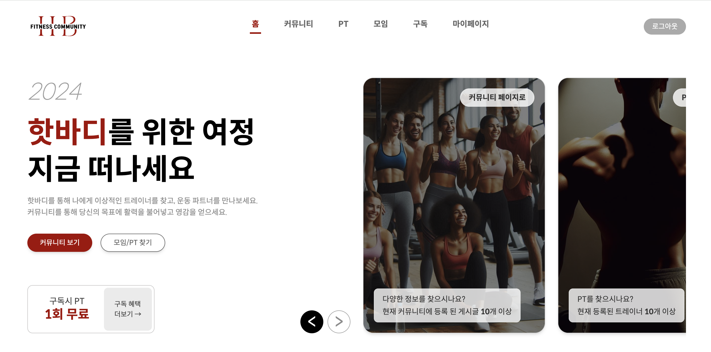

# HOT BODY | 운동 커뮤니티

   

## 목차
1. [프로젝트 설명](#01-프로젝트-개요)
2. [프로젝트 특징](#02-프로젝트-특징)
3. [기술 스택](#03-기술-스택)
4. [개발 기간](#04-개발-기간)
5. [역할 분담](#05-역할-분담)
6. [DB Schema](#06-db-schema)
7. [기능 설명](#07-기능-설명)
8. [프로젝트 후기](#08-프로젝트-후기)

---
 

### 01. 프로젝트 개요
타인과 함께하는 운동은 신체적 그리고 사회적으로 높은 가치를 지닌다. 목표를 함께 성취하는 과정에서 소속감을 형성하고 피드백을 주고 받으며 한단계 높은 결과를 만들어내기도 한다. 시장 조사 결과 운동 분야의 커뮤니티나 SNS가 제한적이었다. 이에 따라 운동을 함께 할 사람을 더 쉽게 찾을 수 있는 운동 커뮤니티 서비스를 기획하게 되었다. 

   

### 02. 프로젝트 특징
- MERN 스택을 사용한 풀 스택 개발
- 글 쓰기/수정/삭제 이외에도 좋아요, 댓글과 같은 기존 커뮤니티의 기능 구현
- PT 트레이너 검색 시 카카오 open api를 사용해 위도/경도를 기반으로 검색
- 비즈니스적으로 유저를 유치하기 위해 포인트와 구독 시스템 도입
- 배포까지 고려해서, 예기치 못한 상황에 에러 발생 시 앱이 다운되지 않게 에러 핸들링에 신경 썼다.

   

### 03. 기술 스택
#### Language & Library & Framework
 

#### State management

#### Database

#### Tools

  

   

### 04. 개발 일정 (WBS)
총 개발 기간 : 2024.04.01 ~ 2024.05.17

   

### 05. 역할 분담

#### 😎 김의현 (팀장)
- 마이페이지 전체
- 고객센터 검색 기능
- 약속 생성 모달 UI
  

#### 🥸 박예빈
- API 디자인
- 백엔드 설계 및 관리
- 커뮤니티, 모임, PT 전체 UI 및 기능
- 메인 페이지 슬라이더
- 유저 상태 전역 관리
  

#### 🤓 이성원
- 로그인, 회원가입 UI
- 구독 결제 UI
- PT 예약 UI 
  

#### 🤩 양재훈
- 구독 페이지 
- 메인 페이지 트레이너 UI

   

### 06. DB Schema

   

### 07. 기능 설명

   

### 08. 프로젝트 후기
#### 😎 김의현
> 프론트엔드 개발자 과정에 처음 입문하게 되었을 때 웹 디자인적인 측면에서 접근을 많이했습니다. 심미적인 측면에서 접근을 할 때에도 기능하지 않거나 기능구현 과정에서 어려움을 겪는다면 반대로 UX에 방해가 되어 좋은 UI가 될 수 없다는 걸 많이 배우게 되었습니다. 기획 단계에서 개발과정 중 처할 난항을 미리 예측하지 못해 포기하게 된 기능이 몇 가지 있는데 이를 통해 개발자의 역할로 프로젝트에 임할 때 추후의 개발 과정을 살필 수 있는 상황에 대해서도 알게 되어 많이 배운 것 같습니다.
  

#### 🥸 박예빈
> 프론트엔드개발자는 사용자에게 좋은 UX를 제공하기 위해서 UI나 기능과 같이 보이는 부분만 잘 만들어내면 된다고 생각했습니다. 하지만 예상치 못한 에러로 인한 어플리케이션의 강제종료나 불필요한 렌더링에 의한 성능 저하와 드러나지 않은 부분을 잘 다루는 것도 좋은 UX를 만드는데 필수적인 기량이라는 생각이 들었습니다. 이번 프로젝트에서 많은 기능들을 구현했기 때문에 기능적 측면에서는 결과물이 만족스럽지만, 시간상 에러 핸들링과 성능 최적화와 같은 비기능적인 측면을 심도있게 다루지 못해서 아쉬움이 많이 남았습니다. 못다룬 부분은 개인적으로 고도화 해서 배포해볼 예정입니다.
  

#### 🤓 이성원
> 도전적이면서도 보람찬 경험이었습니다. 디자인과 기능이 어우러지는 것을 직접 구현하면서, 사용자 인터페이스의 중요성을 싶게 이해하게 되었습니다. 또한, 다양한 프론트엔드 도구와 라이브러리를 사용해 볼 수 있는 기회였습니다. 문제 해결 과정에서는 답답함을 격을 때도 있었지만 맞물려 돌아가는 것을 보며 만족감을 느꼈습니다. 앞으로 더 많은 기술을 배우며 성장해 나가고 싶습니다.
  

#### 🤩 양재훈
> 재미있었습니다